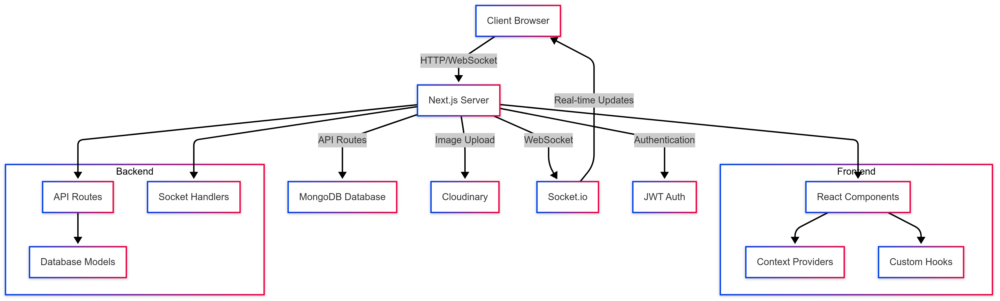

### Coppsary Bok Luy - Game Top-Up Service


## 📋 Project Overview

Coppsary Bok Luy is a comprehensive game top-up platform built with Next.js, allowing users to purchase in-game credits for popular mobile games. The platform features real-time order tracking, secure payment processing, and an intuitive admin dashboard.

### 🌟 Key Features

- **Multi-game support** for Mobile Legends, PUBG Mobile, Free Fire, and more
- **Real-time updates** using Socket.io for instant order status changes
- **Secure payment processing** with multiple payment method options
- **Responsive design** optimized for both mobile and desktop
- **Admin dashboard** with comprehensive order management
- **Multilingual support** with English and Khmer languages


## 🚀 Technologies Used

- **Frontend**: Next.js 14, React, Tailwind CSS, shadcn/ui
- **Backend**: Next.js API Routes, MongoDB, Socket.io
- **Authentication**: JWT for admin authentication
- **Image Storage**: Cloudinary
- **Real-time Communication**: Socket.io
- **Deployment**: Vercel (recommended)


## 🛠️ Getting Started

### Prerequisites

- Node.js 18.x or higher
- MongoDB database
- Cloudinary account (for image uploads)


### Environment Variables

Create a `.env.local` file in the root directory with the following variables:

```plaintext
# MongoDB
MONGODB_URI=your_mongodb_connection_string

# Cloudinary
CLOUDINARY_CLOUD_NAME=your_cloud_name
CLOUDINARY_API_KEY=your_api_key
CLOUDINARY_API_SECRET=your_api_secret

# Authentication
JWT_SECRET=your_jwt_secret
ADMIN_USERNAME=your_admin_username
ADMIN_PASSWORD=your_admin_password
ADMIN_SECRET_PATH=your_admin_secret_path

# Site Configuration
NEXT_PUBLIC_SITE_URL=http://localhost:3000
```

### Installation

1. Clone the repository:

```shellscript
git clone https://github.com/yourusername/coppsary-bok-luy.git
cd coppsary-bok-luy
```


2. Install dependencies:

```shellscript
npm install
```


3. Update the package.json scripts to use the custom server:

```json
 "scripts": {
  "dev": "concurrently \"next dev --turbo\" \"node src/server.js\"",
  "build": "next build",
  "start": "concurrently \"next start\" \"node backend/server.js\"",
  "lint": "next lint"
},
```


4. Start the development server:

```shellscript
npm run dev
```


5. Open [http://localhost:3000](http://localhost:3000) to view the application


### Admin Access

To access the admin dashboard:

1. Navigate to `/auth/your_admin_secret_path`
2. Log in with your admin credentials
3. You'll be redirected to the admin dashboard


## 🏗️ Project Structure

```plaintext
├── app/                  # Next.js App Router
│   ├── admin/            # Admin dashboard pages
│   ├── api/              # API routes
│   ├── auth/             # Authentication pages
│   └── page.jsx          # Homepage
├── components/           # React components
│   ├── admin/            # Admin-specific components
│   ├── modals/           # Modal components
│   └── ui/               # UI components
├── context/              # React context providers
├── db/                   # Database models
├── hooks/                # Custom React hooks
├── lib/                  # Utility functions
├── public/               # Static assets
└── server.js             # Custom server for Socket.io
```

## 🔄 Application Flow

1. **User Flow**:

1. Users browse available games on the homepage
2. Select a game and package for top-up
3. Enter game account details
4. Complete payment
5. Receive confirmation and credits


2. **Admin Flow**:

1. Admins log in through the secure admin portal
2. View and manage orders in real-time
3. Process pending orders
4. Update game listings and promotions
5. Monitor dashboard statistics


3. **Real-time Updates**:

1. Socket.io provides instant updates on order status
2. Admins receive notifications for new orders
3. Users see real-time confirmation of their purchases


## 🧩 Key Components

- **TopUpFlow**: Manages the multi-step top-up process
- **GameContext**: Provides game selection state across components
- **SocketStatus**: Monitors real-time connection status
- **AdminDashboard**: Comprehensive admin interface
- **OrdersManagement**: Real-time order processing system


## 📱 Mobile Responsiveness

The application is fully responsive and optimized for:

- Desktop browsers
- Tablets
- Mobile phones


## 🔒 Security Features

- JWT authentication for admin access
- Secure HTTP-only cookies
- Environment variable protection
- CORS configuration for API routes


## 🌐 Deployment

### Deploying to Vercel

1. Push your code to a GitHub repository
2. Import the project in Vercel
3. Configure the environment variables
4. Deploy


### Custom Server Deployment

For Socket.io functionality, deploy to a platform that supports custom servers:

1. Build the Next.js application: `npm run build`
2. Start the custom server: `npm start`


## 🤝 Contributing

1. Fork the repository
2. Create a feature branch: `git checkout -b feature/amazing-feature`
3. Commit your changes: `git commit -m 'Add amazing feature'`
4. Push to the branch: `git push origin feature/amazing-feature`
5. Open a Pull Request


## 📄 License

This project is licensed under the MIT License - see the LICENSE file for details.

## 📞 Support

For support, email [coppsary@gmail.com](mailto:coppsary@gmail.com) or join our Discord server.

## See the process below


